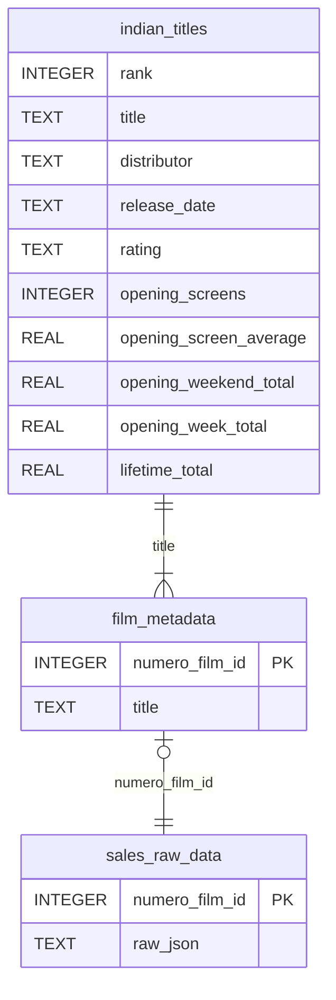

# SQLite Database Schema

## Database Overview

The `numero_data.sqlite` database contains three tables that store Indian film data from 2025, including box office statistics and detailed sales data from the Numero API.

---

## Entity Relationship Diagram



### Relationship Notes

- **Strong relationship** (🔗): `film_metadata` ↔ `sales_raw_data` via `numero_film_id`
  - Primary key relationship with guaranteed 1:1 match
  - Use this for reliable joins between metadata and sales data

- **Weak relationship** (⚠️): `indian_titles` ↔ `film_metadata` via `title`
  - Text-based matching, may have formatting differences
  - Potential issues: extra spaces, punctuation, special characters
  - Not all titles in `indian_titles` may exist in `film_metadata` (only top 100 films have metadata)
  - Recommend using fuzzy matching or `TRIM(LOWER(title))` for better results

---

## Table Schemas

### 1. `indian_titles`
Summary box office data for 2025 Indian film releases (from CSV).

| Column | Type | Description |
|--------|------|-------------|
| `rank` | INTEGER | Box office rank |
| `title` | TEXT | Film title |
| `distributor` | TEXT | Distribution company |
| `release_date` | TEXT | Release date (YYYY-MM-DD) |
| `rating` | TEXT | Film rating (e.g., PG, MA15+) |
| `opening_screens` | INTEGER | Number of opening screens |
| `opening_screen_average` | REAL | Average revenue per screen at opening |
| `opening_weekend_total` | REAL | Total opening weekend revenue |
| `opening_week_total` | REAL | Total opening week revenue |
| `lifetime_total` | REAL | Total lifetime revenue |

**Note**: No primary key defined (can have duplicate entries).

---

### 2. `film_metadata`
Mapping of Numero film IDs to film titles (top 100 films from filmId.json).

| Column | Type | Description |
|--------|------|-------------|
| `numero_film_id` | INTEGER | Primary key - Numero's unique film identifier |
| `title` | TEXT | Film title |

**Primary Key**: `numero_film_id`

---

### 3. `sales_raw_data`
Raw JSON sales data downloaded from the Numero API.

| Column | Type | Description |
|--------|------|-------------|
| `numero_film_id` | INTEGER | Primary key - Numero's unique film identifier |
| `raw_json` | TEXT | JSON string containing detailed sales data by date, circuit, cinema, theatre, and day |

**Primary Key**: `numero_film_id`

**JSON Structure**: The `raw_json` field contains nested data with:
- Week start dates as top-level keys
- For each week: circuit, cinema, theatre, region, and daily box office data (gross, paid admissions)

---

## Connection Guides

### Python Connection

```python
import sqlite3
import pandas as pd

# Connect to database
conn = sqlite3.connect('data/numero_data.sqlite')

# Read a table
df = pd.read_sql('SELECT * FROM film_metadata LIMIT 5', conn)
print(df)

# Close connection
conn.close()
```

---

### R Connection

```r
library(RSQLite)
library(DBI)

# Connect to database
con <- dbConnect(RSQLite::SQLite(), "data/numero_data.sqlite")

# Read a table
df <- dbGetQuery(con, "SELECT * FROM film_metadata LIMIT 5")
print(df)

# Close connection
dbDisconnect(con)
```
